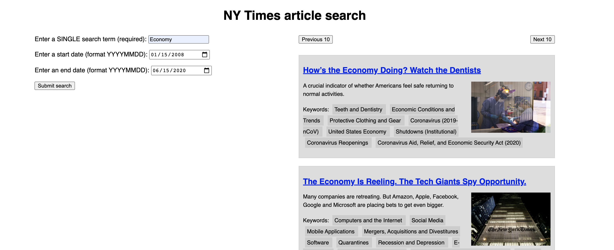

# MDN-learn-web-dev 👨‍💻
This repository contains course material from MDN's [Learn web development](https://developer.mozilla.org/en-US/docs/Learn) module. The majority of work represented in this repository comes from the JavaScript portion of the course. 

Topics Include: 
```
- JavaScript Objects (OOP)
- JavaScript Events
- DOM Manipulation
- Asynchronous JavaScript
- Third-Party APIs
- Client-Side Storage
- Server-Side Programming
- Website Security
```

## Completed Projects

###### [Bouncing Balls](https://github.com/daniel-covelli/MDN-learn-web-dev/tree/master/js-objects/bounding-balls)


###### [New York Times API](https://github.com/daniel-covelli/MDN-learn-web-dev/tree/master/APIs/third-party)

